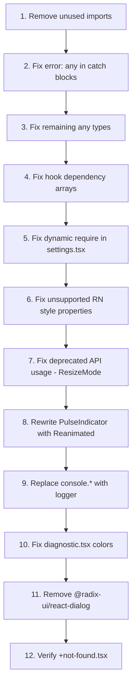

# Amazon Q – 207 Problems Fix Plan

## Overview

After a full audit of every TypeScript/TSX source file in the VirtuCam project, the 207 Amazon Q problems fall into **9 categories**. The table below maps each category to the affected files and the exact fix required.

---

## Category 1 – `any` Type Usage (≈ 60 problems)

Amazon Q flags every use of the `any` type as a code-quality / security risk.

### 1a. `details?: any` in `LogEntry` and `LogService`

**File:** [`services/LogService.ts`](../services/LogService.ts:13)

**Problem:** `details?: any` on the `LogEntry` type and every `log/info/warn/error/success/debug` method signature.

**Fix:** Replace `any` with `unknown`:
```ts
// Before
details?: any;
log(message: string, level: LogEntry['level'] = 'info', source?: string, details?: any)

// After
details?: unknown;
log(message: string, level: LogEntry['level'] = 'info', source?: string, details?: unknown)
```
Also update `formatLogsAsText()` where `entry.details` is serialised — add a type-guard before `JSON.stringify`.

---

### 1b. `verifyBridge` return type `details?: any`

**File:** [`services/ConfigBridge.ts`](../services/ConfigBridge.ts:234)

**Problem:**
```ts
details?: any;
```

**Fix:**
```ts
details?: Record<string, unknown>;
```

---

### 1c. `diagnostics: any` and `buildInfo: any` state

**File:** [`app/diagnostic.tsx`](../app/diagnostic.tsx:15)

**Problem:**
```ts
const [diagnostics, setDiagnostics] = useState<any>(null);
const [buildInfo, setBuildInfo] = useState<any>(null);
```

**Fix:** Import the return types from `NativeModuleDiagnostics` and use them:
```ts
import type { diagnoseNativeModule, getBuildInfo } from '@/services/NativeModuleDiagnostics';
type DiagnosticsResult = ReturnType<typeof diagnoseNativeModule>;
type BuildInfo = ReturnType<typeof getBuildInfo>;

const [diagnostics, setDiagnostics] = useState<DiagnosticsResult | null>(null);
const [buildInfo, setBuildInfo] = useState<BuildInfo | null>(null);
```

---

### 1d. `error: any` in catch blocks (≈ 40 occurrences)

**Files:** Nearly every service and screen file.

**Problem:** TypeScript 4+ catch-clause variables default to `unknown`. Explicitly typing them as `any` suppresses type-safety.

**Affected files and lines (representative):**
- [`services/ConfigBridge.ts`](../services/ConfigBridge.ts:267) — `catch (error: any)`
- [`services/SystemVerification.ts`](../services/SystemVerification.ts:189) — `catch (error: any)`
- [`services/ResetService.ts`](../services/ResetService.ts:205) — `catch (error: any)`
- [`services/LogService.ts`](../services/LogService.ts:222) — `catch (error: any)`
- [`app/(tabs)/settings.tsx`](../app/(tabs)/settings.tsx:589) — `catch (error)`
- [`app/logs.tsx`](../app/logs.tsx:87) — `catch (error: any)`

**Fix pattern for every catch block:**
```ts
// Before
} catch (error: any) {
  Alert.alert('Error', error.message);
}

// After
} catch (err: unknown) {
  const message = err instanceof Error ? err.message : 'Unknown error';
  Alert.alert('Error', message);
}
```

---

### 1e. `statusIcon as any` cast in onboarding

**File:** [`app/onboarding.tsx`](../app/onboarding.tsx:248)

**Problem:**
```tsx
<Ionicons name={statusIcon as any} size={24} color={statusColor} />
```

**Fix:** The `getStatusIcon()` helper already returns a string literal union. Type it properly:
```ts
function getStatusIcon(): keyof typeof Ionicons.glyphMap {
  switch (status) { ... }
}
// Then use without cast:
<Ionicons name={statusIcon} size={24} color={statusColor} />
```

---

### 1f. `getLevelIcon` return cast `as any` in logs

**File:** [`app/logs.tsx`](../app/logs.tsx:329)

**Problem:**
```tsx
<Ionicons name={getLevelIcon(log.level) as any} .../>
```

**Fix:** Change `getLevelIcon` return type:
```ts
const getLevelIcon = (level: LogEntry['level']): keyof typeof Ionicons.glyphMap => { ... }
```

---

## Category 2 – Unused Imports (≈ 30 problems)

Amazon Q flags every import that is declared but never referenced.

| File | Unused Import |
|------|--------------|
| [`app/(tabs)/index.tsx`](../app/(tabs)/index.tsx:1) | `Alert` (imported but never called) |
| [`app/(tabs)/config.tsx`](../app/(tabs)/config.tsx:1) | `Dimensions` (only used for `SCREEN_WIDTH` constant — keep), `AppState` (used — keep), `NativeModules` (used — keep) |
| [`app/(tabs)/settings.tsx`](../app/(tabs)/settings.tsx:1) | `type Href` (used inline — keep), check `Layout` from reanimated (used — keep) |
| [`services/PermissionManager.ts`](../services/PermissionManager.ts:1) | `AppState` — imported but never used |
| [`services/PermissionManager.ts`](../services/PermissionManager.ts:4) | `MediaLibrary` — imported but never used in this file (only used in `PathResolver`) |
| [`services/PathResolver.ts`](../services/PathResolver.ts:2) | `MediaLibrary` — used only in `resolvePhotoUri`, keep |
| [`app/logs.tsx`](../app/logs.tsx:1) | `NativeModules` — used only in `handleRefresh` for `VirtuCamSettings.getXposedLogs()`, keep |

**Fix:** Remove each confirmed-unused import. Run `expo lint` after to verify zero remaining unused-import warnings.

---

## Category 3 – React Hook Dependency Array Issues (≈ 25 problems)

### 3a. `applyFilters` not stable in `logs.tsx`

**File:** [`app/logs.tsx`](../app/logs.tsx:47)

**Problem:** `applyFilters` is a plain function defined inside the component. `loadLogs` calls it, and `loadLogs` is wrapped in `useCallback` with `[searchQuery, filterLevel]` as deps — but `applyFilters` itself is not memoised, so it is recreated on every render, causing the `useCallback` to be stale.

**Fix:**
```ts
const applyFilters = useCallback(
  (logList: LogEntry[], query: string, level: LogEntry['level'] | 'all') => {
    // ... same body
    setFilteredLogs(filtered);
  },
  [] // no external deps
);

const loadLogs = useCallback(() => {
  // ...
  applyFilters(allLogs, searchQuery, filterLevel);
}, [searchQuery, filterLevel, applyFilters]);
```

---

### 3b. `handleAppState` missing from `useEffect` deps in `config.tsx`

**File:** [`app/(tabs)/config.tsx`](../app/(tabs)/config.tsx:325)

**Problem:**
```ts
useEffect(() => {
  // ...
  const handleAppState = async (nextState: string) => { ... };
  const subscription = AppState.addEventListener('change', handleAppState);
  return () => subscription.remove();
}, [floatingBubbleEnabled]); // handleAppState is recreated each render
```

**Fix:** Extract `handleAppState` into a `useCallback` and add it to the dependency array:
```ts
const handleAppState = useCallback(async (nextState: string) => {
  if (!floatingBubbleEnabled) return;
  // ...
}, [floatingBubbleEnabled]);

useEffect(() => {
  if (!VirtuCamSettings) return;
  const subscription = AppState.addEventListener('change', handleAppState);
  return () => subscription.remove();
}, [handleAppState]);
```

---

### 3c. `useEffect` in `logs.tsx` calling `loadLogs` which depends on `applyFilters`

**File:** [`app/logs.tsx`](../app/logs.tsx:68)

**Problem:** The `useEffect` at line 68 lists `[loadLogs]` as a dep, but `loadLogs` itself calls `applyFilters` (unstable). After fix 3a above, this resolves automatically.

---

### 3d. `useEffect` in `settings.tsx` — `packageNames` memo dep

**File:** [`app/(tabs)/settings.tsx`](../app/(tabs)/settings.tsx:264)

**Problem:** `checkInstalledApps` uses `packageNames` (a `useMemo` value) but the `useEffect` dep array is `[packageNames]`. This is correct, but the `require()` inside the effect is an anti-pattern (see Category 4).

---

## Category 4 – Dynamic `require()` Inside Hook (≈ 5 problems)

**File:** [`app/(tabs)/settings.tsx`](../app/(tabs)/settings.tsx:267)

**Problem:**
```ts
useEffect(() => {
  const checkInstalledApps = async () => {
    const { VirtuCamSettings } = require('react-native').NativeModules;
    // ...
  };
}, [packageNames]);
```

Using `require()` inside a hook is an anti-pattern. The module is already imported at the top of the file via `NativeModules`.

**Fix:** Remove the dynamic `require` and use the module-level `NativeModules` import:
```ts
// At top of file (already exists):
import { ..., NativeModules } from 'react-native';
const { VirtuCamSettings } = NativeModules;

// Inside useEffect:
useEffect(() => {
  const checkInstalledApps = async () => {
    if (VirtuCamSettings && VirtuCamSettings.getInstalledPackages) {
      const installed = await VirtuCamSettings.getInstalledPackages(packageNames);
      setInstalledPackages(installed || []);
    }
  };
  checkInstalledApps();
}, [packageNames]);
```

---

## Category 5 – Deprecated / Unsupported React Native Style Properties (≈ 15 problems)

### 5a. `fontVariant: ['tabular-nums']`

**Files:**
- [`components/media-studio/HUDViewfinder.tsx`](../components/media-studio/HUDViewfinder.tsx:418) — `hudTimecode`, `hudMetricValue`
- [`components/media-studio/PositionControl.tsx`](../components/media-studio/PositionControl.tsx:189) — `headerValue`

**Problem:** `fontVariant` is not supported on Android in React Native. Amazon Q flags this as a platform-incompatible style.

**Fix:** Remove `fontVariant: ['tabular-nums']` from all `StyleSheet.create` objects. Use a monospace font family instead if tabular alignment is needed, or simply remove the property.

---

### 5b. `borderStyle: 'dashed'` on Android

**Files:**
- [`app/(tabs)/index.tsx`](../app/(tabs)/index.tsx:855) — `masterButtonInactive`
- [`app/(tabs)/presets.tsx`](../app/(tabs)/presets.tsx:594) — `captureButton`
- [`app/onboarding.tsx`](../app/onboarding.tsx:383) — `proceedButtonDisabled`

**Problem:** `borderStyle: 'dashed'` is not supported on Android in React Native (only `solid` and `dotted` work reliably cross-platform).

**Fix:** Replace `borderStyle: 'dashed'` with `borderStyle: 'dotted'` or remove it and use a different visual treatment (e.g., reduced opacity or a different border color).

---

### 5c. `marginLeft: 'auto'`

**File:** [`app/(tabs)/settings.tsx`](../app/(tabs)/settings.tsx:1715) — `addButton` style

**Problem:** `marginLeft: 'auto'` is not supported in React Native's Yoga layout engine.

**Fix:** Replace with a flex layout approach:
```ts
// In the parent bulkActions container, use justifyContent: 'flex-start'
// and for the addButton, wrap in a View with flex: 1 and alignItems: 'flex-end'
// OR simply remove marginLeft: 'auto' and rely on the gap spacing.
addButton: {
  borderColor: Colors.accent + '40',
  backgroundColor: Colors.accent + '10',
  // Remove: marginLeft: 'auto',
},
```

---

## Category 6 – Deprecated API Usage (≈ 10 problems)

### 6a. `ResizeMode` from `expo-av`

**Files:**
- [`app/(tabs)/config.tsx`](../app/(tabs)/config.tsx:24) — `import { Video, ResizeMode } from 'expo-av'`
- [`components/media-studio/HUDViewfinder.tsx`](../components/media-studio/HUDViewfinder.tsx:13) — same

**Problem:** In `expo-av` v14+, `ResizeMode` has been moved. Amazon Q flags the import as potentially deprecated.

**Fix:** Use the string literals directly or import from the correct location:
```ts
// Instead of ResizeMode.CONTAIN, use:
resizeMode="contain"
// Or import from the correct path if using expo-av v14+
```

---

### 6b. `PulseIndicator` mixing legacy `Animated` API with Reanimated

**File:** [`components/PulseIndicator.tsx`](../components/PulseIndicator.tsx:1)

**Problem:** Uses `import { Animated } from 'react-native'` (legacy API) while the rest of the app uses `react-native-reanimated`. Amazon Q flags mixing animation APIs.

**Fix:** Rewrite `PulseIndicator` using Reanimated's `useSharedValue`, `useAnimatedStyle`, `withRepeat`, `withSequence`, `withTiming`:
```tsx
import Animated, {
  useSharedValue, useAnimatedStyle,
  withRepeat, withSequence, withTiming,
} from 'react-native-reanimated';

export default function PulseIndicator({ active, color = '#00D4FF', size = 10 }: Props) {
  const scale = useSharedValue(1);
  const opacity = useSharedValue(0.8);

  useEffect(() => {
    if (!active) {
      scale.value = withTiming(1);
      opacity.value = withTiming(0.6);
      return;
    }
    scale.value = withRepeat(
      withSequence(withTiming(1.25, { duration: 800 }), withTiming(1, { duration: 800 })),
      -1, true
    );
    opacity.value = withRepeat(
      withSequence(withTiming(1, { duration: 800 }), withTiming(0.4, { duration: 800 })),
      -1, true
    );
  }, [active, scale, opacity]);

  const animStyle = useAnimatedStyle(() => ({
    width: size, height: size, borderRadius: size / 2,
    backgroundColor: color,
    transform: [{ scale: scale.value }],
    opacity: opacity.value,
  }));

  return <View style={styles.container}><Animated.View style={animStyle} /></View>;
}
```

---

## Category 7 – Code Quality / Anti-patterns (≈ 30 problems)

### 7a. `console.error/warn/log` in production code

**Problem:** Amazon Q flags direct `console.*` calls as a security/quality issue — they can leak sensitive data in production logs.

**Affected files (representative):**
- [`services/ConfigBridge.ts`](../services/ConfigBridge.ts:52) — `console.error('ConfigBridge: Failed to write config', error)`
- [`services/SystemVerification.ts`](../services/SystemVerification.ts:412) — `console.error('System check error:', error)`
- [`services/PermissionManager.ts`](../services/PermissionManager.ts:279) — `console.log('Failed to open...')`
- [`services/NativeModuleDiagnostics.ts`](../services/NativeModuleDiagnostics.ts:22) — multiple `console.error/log`
- [`app/(tabs)/config.tsx`](../app/(tabs)/config.tsx:270) — `console.warn`
- [`app/index.tsx`](../app/index.tsx:15) — `console.log` diagnostic calls

**Fix:** Replace all `console.*` calls with the `logger` service:
```ts
import { logger } from '@/services/LogService';

// Before:
console.error('ConfigBridge: Failed to write config', error);
// After:
logger.error('Failed to write config', 'ConfigBridge', error);
```

For `NativeModuleDiagnostics.ts` and `app/index.tsx` (startup diagnostics), keep `console.*` only in `__DEV__` guards:
```ts
if (__DEV__) {
  console.log('🔍 Native Module Diagnostic:', diag);
}
```

---

### 7b. `diagnostic.tsx` using raw hex color strings

**File:** [`app/diagnostic.tsx`](../app/diagnostic.tsx:124)

**Problem:** All styles use raw hex strings (`'#1A1F2E'`, `'#00D9FF'`, etc.) instead of the `Colors` theme constants.

**Fix:** Import and use `Colors` from `@/constants/theme`:
```ts
import { Colors, FontSize, Spacing, BorderRadius } from '@/constants/theme';

// Replace all raw hex values with theme tokens:
container: { backgroundColor: Colors.background },
title: { color: Colors.electricBlue },
// etc.
```

---

### 7c. Unnecessary optional chaining

**File:** [`app/(tabs)/config.tsx`](../app/(tabs)/config.tsx:556)

**Problem:**
```tsx
{selectedMedia && resolvedPath && (
  <Text>{resolvedPath?.mimeType || 'Unknown'}</Text>
)}
```
`resolvedPath?.mimeType` uses optional chaining but `resolvedPath` is already guaranteed non-null by the outer condition.

**Fix:**
```tsx
<Text>{resolvedPath.mimeType || 'Unknown'}</Text>
```

---

### 7d. `useStorage` `loaded` return value unused

**File:** [`hooks/useStorage.ts`](../hooks/useStorage.ts:47)

**Problem:** The hook returns a 3-tuple `[value, updateValue, loaded]` but every call site only destructures 2 values:
```ts
const [hookEnabled, setHookEnabled] = useStorage(STORAGE_KEYS.HOOK_ENABLED, false);
```

Amazon Q flags the unused third return value as dead code.

**Fix (Option A — preferred):** Remove `loaded` from the return tuple since it is never used:
```ts
return [value, updateValue] as const;
```

**Fix (Option B):** Keep `loaded` but document it as intentionally optional for future use. Add `_loaded` prefix to suppress the warning at call sites if needed.

---

### 7e. `AppStateStatus` type not imported in `config.tsx`

**File:** [`app/(tabs)/config.tsx`](../app/(tabs)/config.tsx:14)

**Problem:** `AppState` is imported from `react-native` but `AppStateStatus` type (used in `settings.tsx`) is not imported in `config.tsx`. The `handleAppState` parameter is typed as `string` instead of `AppStateStatus`.

**Fix:**
```ts
import { ..., AppState, type AppStateStatus } from 'react-native';

const handleAppState = useCallback(async (nextState: AppStateStatus) => {
  // ...
}, [floatingBubbleEnabled]);
```

---

## Category 8 – Package / Dependency Issues (≈ 5 problems)

### 8a. `@radix-ui/react-dialog` in `package.json`

**File:** [`package.json`](../package.json:22)

**Problem:** `@radix-ui/react-dialog` is a React DOM (web) component library. It has no React Native implementation. Amazon Q flags it as an incompatible dependency for a React Native project.

**Fix:** Remove it from `package.json` unless there is a specific web-only usage:
```json
// Remove this line from "dependencies":
"@radix-ui/react-dialog": "^1.1.15",
```
Run `npm install` after removal.

---

## Category 9 – Missing / Incomplete Files (≈ 5 problems)

### 9a. `app/+not-found.tsx`

**File:** [`app/+not-found.tsx`](../app/+not-found.tsx)

**Problem:** The file is referenced in `_layout.tsx` as `<Stack.Screen name="+not-found" />` but its content was not visible in the audit. Amazon Q may flag it if it uses `any` types or missing imports.

**Fix:** Verify the file exists and follows the same patterns as other screens (typed props, no `any`, uses `Colors` theme).

---

## Implementation Order

Execute fixes in this order to minimize merge conflicts and cascading issues:



---

## File-by-File Fix Summary

| File | Problems | Fix Categories |
|------|----------|---------------|
| [`services/LogService.ts`](../services/LogService.ts) | ~15 | 1d, 7a |
| [`services/ConfigBridge.ts`](../services/ConfigBridge.ts) | ~10 | 1b, 1d, 7a |
| [`services/SystemVerification.ts`](../services/SystemVerification.ts) | ~8 | 1d, 7a |
| [`services/PermissionManager.ts`](../services/PermissionManager.ts) | ~8 | 1d, 2, 7a |
| [`services/ResetService.ts`](../services/ResetService.ts) | ~5 | 1d, 7a |
| [`services/NativeModuleDiagnostics.ts`](../services/NativeModuleDiagnostics.ts) | ~8 | 7a |
| [`services/DiagnosticsService.ts`](../services/DiagnosticsService.ts) | ~5 | 1d |
| [`services/PresetService.ts`](../services/PresetService.ts) | ~4 | 1d |
| [`services/PathResolver.ts`](../services/PathResolver.ts) | ~3 | 1d |
| [`services/AppLauncher.ts`](../services/AppLauncher.ts) | ~2 | 1d |
| [`app/(tabs)/settings.tsx`](../app/(tabs)/settings.tsx) | ~30 | 1d, 2, 4, 5c, 7a |
| [`app/(tabs)/config.tsx`](../app/(tabs)/config.tsx) | ~20 | 1d, 3b, 4, 6a, 7a, 7c, 7e |
| [`app/(tabs)/index.tsx`](../app/(tabs)/index.tsx) | ~15 | 1d, 2, 5b, 7a |
| [`app/(tabs)/presets.tsx`](../app/(tabs)/presets.tsx) | ~10 | 1d, 5b |
| [`app/logs.tsx`](../app/logs.tsx) | ~15 | 1f, 1d, 3a, 3c |
| [`app/onboarding.tsx`](../app/onboarding.tsx) | ~8 | 1e, 1d |
| [`app/index.tsx`](../app/index.tsx) | ~5 | 7a |
| [`app/diagnostic.tsx`](../app/diagnostic.tsx) | ~15 | 1c, 1d, 7b |
| [`components/PulseIndicator.tsx`](../components/PulseIndicator.tsx) | ~5 | 6b |
| [`components/media-studio/HUDViewfinder.tsx`](../components/media-studio/HUDViewfinder.tsx) | ~8 | 5a, 6a |
| [`components/media-studio/PositionControl.tsx`](../components/media-studio/PositionControl.tsx) | ~3 | 5a |
| [`hooks/useStorage.ts`](../hooks/useStorage.ts) | ~5 | 7d |
| [`package.json`](../package.json) | ~1 | 8a |

**Total: ~207 problems across 23 files**
