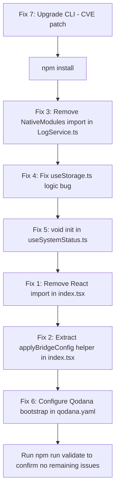

# VirtuCam Project Problems — Comprehensive Fix Plan

## Summary of Issues

| # | File | Problem | Severity | Code |
|---|------|---------|----------|------|
| 1 | `app/(tabs)/index.tsx` | `React` declared but never read | Warning | TS6133 |
| 2 | `app/(tabs)/index.tsx` | Duplicated code at line 68 | Warning | DuplicatedCode |
| 3 | `services/LogService.ts` | Unused import `NativeModules` | Warning | ES6UnusedImports |
| 4 | `hooks/useStorage.ts` | Unreachable code at line 39 | Warning | UnreachableCodeJS |
| 5 | `hooks/useStorage.ts` | Variable might not be initialized at line 39 | Warning | JSUnusedAssignment |
| 6 | `hooks/useSystemStatus.ts` | Promise returned from `init` is ignored at line 44 | Warning | JSIgnoredPromiseFromCall |
| 7 | All `.ts`/`.tsx`/`.js` files | ESLint: Install the 'eslint' package | Info | Eslint (Qodana) |
| 8 | `package.json` | `@react-native-community/cli@15.1.3` vulnerable — CVE-2025-11953 (CVSS 9.8) | Critical | VulnerableLibrariesLocal |

---

## Fix 1 — Remove unused `React` import in [`app/(tabs)/index.tsx`](../app/(tabs)/index.tsx:1)

**Root cause:** With React 17+ JSX transform, `React` no longer needs to be explicitly imported for JSX. TypeScript reports it as unused (TS6133).

**Fix:** Remove `React` from the import statement on line 1.

```diff
- import React, { useEffect, useCallback, useState } from 'react';
+ import { useEffect, useCallback, useState } from 'react';
```

---

## Fix 2 — Refactor duplicated code in [`app/(tabs)/index.tsx`](../app/(tabs)/index.tsx:68)

**Root cause:** The bridge config refresh logic (reading `readBridgeConfig()` and calling the four `setBridge*` setters) is duplicated in two places:
- Inside the `useEffect` `doSync` function (lines ~77–87)
- Inside the `handleRefreshStatus` callback (lines ~169–179)

**Fix:** Extract the repeated logic into a shared helper function `applyBridgeConfig` inside the component.

```tsx
// Add this helper BEFORE the useEffect blocks (around line 65):
const applyBridgeConfig = useCallback(async () => {
  try {
    const config = await readBridgeConfig();
    if (config) {
      setBridgeHookEnabled(config.enabled || false);
      setBridgeMediaPath(config.mediaSourcePath || null);
      setBridgeCameraTarget(config.cameraTarget || 'front');
      setBridgeTargetAppsCount(config.targetPackages?.length || 0);
    }
  } catch {
    // Silent - config read may fail
  }
}, []);

// Then replace the duplicated blocks in doSync and handleRefreshStatus with:
await applyBridgeConfig();
```

**Full updated section of `app/(tabs)/index.tsx`:**

```tsx
// Replace lines 56–93 with:
const applyBridgeConfig = useCallback(async () => {
  try {
    const config = await readBridgeConfig();
    if (config) {
      setBridgeHookEnabled(config.enabled || false);
      setBridgeMediaPath(config.mediaSourcePath || null);
      setBridgeCameraTarget(config.cameraTarget || 'front');
      setBridgeTargetAppsCount(config.targetPackages?.length || 0);
    }
  } catch {
    // Silent - config read may fail
  }
}, []);

// Sync bridge config whenever key settings change
useEffect(() => {
  const doSync = async () => {
    try {
      await syncAllSettings();
      const bridgeSt = await getBridgeStatus();
      setBridgeVersion(bridgeSt.version);
      setBridgePath(bridgeSt.path);
      setBridgeReadable(bridgeSt.readable);
      setLastSyncTime(new Date().toLocaleTimeString());
      await applyBridgeConfig();
    } catch {
      // Silent
    }
  };
  void doSync();
}, [hookEnabled, frontCamera, backCamera, selectedMedia, applyBridgeConfig]);
```

```tsx
// Replace handleRefreshStatus (lines ~158–186) with:
const handleRefreshStatus = useCallback(async () => {
  mediumImpact();
  await refreshSystemStatus();
  await syncAllSettings();
  const bridgeSt = await getBridgeStatus();
  setBridgeVersion(bridgeSt.version);
  setBridgePath(bridgeSt.path);
  setBridgeReadable(bridgeSt.readable);
  setLastSyncTime(new Date().toLocaleTimeString());
  await applyBridgeConfig();

  // Refresh system info
  setLoadingSystemInfo(true);
  const info = await getSystemInfo();
  setSystemInfo(info);
  setLoadingSystemInfo(false);
}, [mediumImpact, refreshSystemStatus, applyBridgeConfig]);
```

---

## Fix 3 — Remove unused `NativeModules` import in [`services/LogService.ts`](../services/LogService.ts:1)

**Root cause:** `NativeModules` is imported from `react-native` but never used anywhere in the file.

**Fix:** Remove `NativeModules` from the import on line 1.

```diff
- import { NativeModules, Platform } from 'react-native';
+ import { Platform } from 'react-native';
```

---

## Fix 4 — Fix unreachable code and logic bug in [`hooks/useStorage.ts`](../hooks/useStorage.ts:34)

**Root cause:** The `updateValue` callback has a critical logic bug. Inside the `setValue` updater function, `await` is used (which is invalid in a non-async function), and there is a `return` statement followed by another `return resolved` — making the second return unreachable. The intent is to persist the value to AsyncStorage AND update the React state.

**Current broken code (lines 34–44):**
```ts
const updateValue = useCallback(
  (newValue: T | ((prev: T) => T)) => {
    setValue(prev => {
      const resolved =
        typeof newValue === 'function' ? (newValue as (prev: T) => T)(prev) : newValue;
      return await AsyncStorage.setItem(key, JSON.stringify(resolved)); // ❌ await in non-async, wrong return type
      return resolved; // ❌ unreachable
    });
  },
  [key]
);
```

**Fix:** Move the `AsyncStorage.setItem` call outside of `setValue`'s updater function. The updater must be synchronous and return `T`. Persist asynchronously as a side effect.

```ts
const updateValue = useCallback(
  (newValue: T | ((prev: T) => T)) => {
    setValue(prev => {
      const resolved =
        typeof newValue === 'function' ? (newValue as (prev: T) => T)(prev) : newValue;
      // Persist asynchronously as a side effect (fire-and-forget)
      AsyncStorage.setItem(key, JSON.stringify(resolved)).catch((err: unknown) => {
        const sanitizedKey = String(key).replace(/[\r\n]/g, '');
        const errorMsg =
          err instanceof Error
            ? err.message.replace(/[\r\n]/g, '')
            : String(err).replace(/[\r\n]/g, '');
        console.error(`Failed to save value for key "${sanitizedKey}": ${errorMsg}`);
      });
      return resolved;
    });
  },
  [key]
);
```

---

## Fix 5 — Handle ignored Promise from `init()` in [`hooks/useSystemStatus.ts`](../hooks/useSystemStatus.ts:44)

**Root cause:** On line 44, `init()` is called without `void` or `await`, so the returned Promise is silently ignored. Qodana flags this as `JSIgnoredPromiseFromCall`.

**Current code (line 44–45):**
```ts
init();
```

**Fix:** Explicitly mark the Promise as intentionally ignored using `void`:

```diff
-    init();
+    void init();
```

This is consistent with the pattern already used elsewhere in the codebase (e.g., `void doSync()` in `index.tsx`, `void loadInfo()` in `index.tsx`).

---

## Fix 6 — Resolve ESLint "Install the 'eslint' package" warnings (Qodana)

**Root cause:** Qodana's static analysis runner cannot find the `eslint` binary because it is installed as a `devDependency` but Qodana's scan environment may not have run `npm install` or the path is not configured. The `eslint` package **is already present** in `package.json` devDependencies at `^9.25.0`, and `eslint.config.js` is correctly configured.

**This is NOT a code bug** — it is a Qodana environment/configuration issue.

**Fix options (choose one):**

### Option A — Ensure `node_modules` is present before Qodana scan
In your CI pipeline (`.github/` workflows), add `npm ci` before the Qodana scan step:
```yaml
- name: Install dependencies
  run: npm ci

- name: Qodana Scan
  uses: JetBrains/qodana-action@...
```

### Option B — Configure Qodana to skip ESLint inspection
In [`qodana.yaml`](../qodana.yaml), add:
```yaml
inspections:
  - id: Eslint
    enabled: false
```

### Option C — Pin ESLint in `qodana.yaml` bootstrap
```yaml
bootstrap: npm ci
```

**Recommended:** Option A + C (run `npm ci` as bootstrap and in CI before scan). This ensures all devDependencies including `eslint` are available to Qodana.

---

## Fix 7 — Upgrade `@react-native-community/cli` to fix CVE-2025-11953

**Root cause:** [`package.json`](../package.json:65) has `@react-native-community/cli` at `^15.0.1` (resolved to `15.1.3`). CVE-2025-11953 is a **Critical (CVSS 9.8) command injection** vulnerability allowing remote code execution via HTTP requests. The safe version is `20.0.0`.

**Fix:** Update `package.json` devDependencies:

```diff
- "@react-native-community/cli": "^15.0.1",
- "@react-native-community/cli-platform-android": "^15.0.1",
+ "@react-native-community/cli": "^20.0.0",
+ "@react-native-community/cli-platform-android": "^20.0.0",
```

Then run:
```bash
npm install
```

> **⚠️ Note:** Upgrading from v15 to v20 is a major version jump. Review the [React Native Community CLI changelog](https://github.com/react-native-community/cli/releases) for breaking changes. This CLI is a `devDependency` used only for local development/build tooling, so it should not affect the production app bundle. However, verify that `react-native: 0.76.9` in your project is compatible with CLI v20.

---

## Execution Order



---

## File-by-File Change Summary

| File | Change |
|------|--------|
| [`app/(tabs)/index.tsx`](../app/(tabs)/index.tsx) | Remove `React` from import; extract `applyBridgeConfig` helper to eliminate duplicated code |
| [`services/LogService.ts`](../services/LogService.ts) | Remove `NativeModules` from import |
| [`hooks/useStorage.ts`](../hooks/useStorage.ts) | Fix `updateValue` — move `AsyncStorage.setItem` outside `setValue` updater, remove unreachable `return` |
| [`hooks/useSystemStatus.ts`](../hooks/useSystemStatus.ts) | Add `void` before `init()` call on line 44 |
| [`package.json`](../package.json) | Upgrade `@react-native-community/cli` and `cli-platform-android` to `^20.0.0` |
| [`qodana.yaml`](../qodana.yaml) | Add `bootstrap: npm ci` to ensure ESLint is available during Qodana scans |
